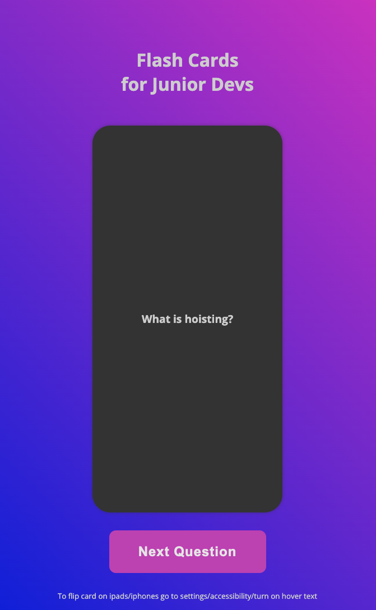

## Flash Cards for Junior Devs

### The challenge:

App for junior front end developers to master common coding interview questions via flash cards.

### Screenshot

### Process

- Create draft of README file
- Create .gitignore file
- Create Github repository
- Work on HTML, CSS and JS files
- Check final code and accessibility
- Finalize README file
- Publish live URL

### Thoughts during the build

- Listen for click on button to pull question from data.js
- Display question on front
- When user hovers on question, flip card to answer on back
- The card should be big enough to hold the questions and answers
- Make sure the contrast is ok
- Include a navigation to show what the game is about...
- Filter questions between React, JS, CSS and HTML
- If a question has already been asked don't show again.

### Resources:

https://github.com/h5bp/Front-end-Developer-Interview-Questions/tree/main
https://blog.hubspot.com/website/javascript-interview-questions
https://stackoverflow.com/questions/75974325/how-to-make-hover-work-correct-for-mobile
